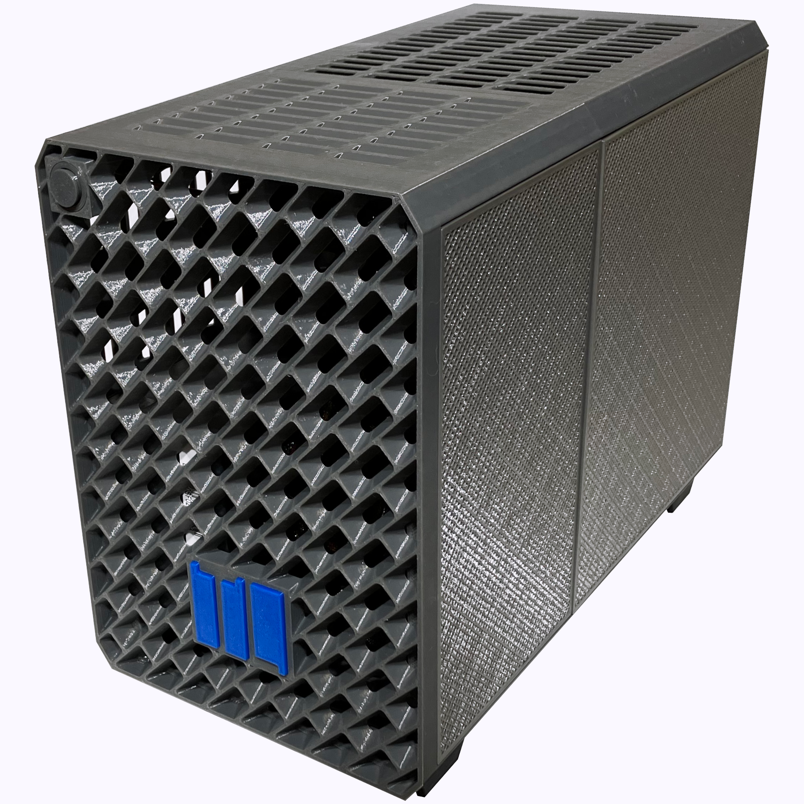

**Useful links**
- [Purchase a Tiny Llama AI Home Server](https://insightreactions.com/store)
- [Tiny Llama User Guides](https://tinyllama.insightreactions.com/guides)
- [Debian Repository](https://github.com/InsightReactions/debian.insightreactions.github.io)
- [Model Repository](https://huggingface.co/InsightReactions/TinyLlama)

**Table of Contents**
- [About Tiny Llama](#about-tiny-llama)
- [Tiny Llama AI Home Server](#tiny-llama-ai-home-server)
- [Minimum System Requirements](#minimum-system-requirements)
- [Installation](#installation)
- [Disclaimers](#disclaimers)
  - [Usage Guidelines](#usage-guidelines)
  - [Model and AI Plugin Licensing](#model-and-ai-plugin-licensing)
    - [Licensing Terms for Third-Party Packages](#licensing-terms-for-third-party-packages)
    - [Use at Your Own Risk](#use-at-your-own-risk)
  - [Security](#security)

# About Tiny Llama

Harness the power of:
- Stable Diffusion image generation, powered by SwarmUI or SD WebUI, for breathtaking image quality.
- Robust LLM chat interfaces with Open WebUI for intelligent conversations.
- Immersive 3D Character role-play or virtual assistants powered by Amica.
- Streamlined AI agent workflows enabled by Langflow.
- Managed & effortless system updates by InsightReactions, ensuring optimal quality and stability for various bleeding edge technologies.

With our permissive open-source licensing structure, you're in control.

Tiny Llama is a baseline configuration layer on top of Debian:latest, which provides the following value:
- Pre-packaged AI WebUI software which alleviates the technical experience required to use the latest open-source AI products and can be enjoyed on any device with appropriate aspect ratio displays (per-product basis).
- Effortless access to a growing and continuously updating repository of cutting-edge open-source AI technologies
- mDNS server auto-discovery support for ease of access using your favorite mobile web browser
- A landing page on port 80 for a 'Home Portal' where all of the web apps can be accessed without memorizing or bookmarking urls
- Premium content that provides a 'robust default experience' for each AI product

**[Explore our ever-expanding cookbook](https://tinyllama.insightreactions.com/guides/) to learn more about Tiny Llama.**

Notice: Tiny Llama is primarily geared toward serving home users in a non-commercial/hobbyist context with pre-configured COTS hardware to encourage wide adoption of AI technologies by the general public.

# Tiny Llama AI Home Server

Introducing the Tiny Llama AI Home Server - Your Ultimate Open-Source Generative AI Companion!

Experience cutting-edge image generation and large language models with our affordable, plug-and-play Mini-ITX PC. Designed for users familiar with generative AI technologies like ChatGPT and Midjourney/DALL-E, the Tiny Llama AI Home Server prioritizes privacy and control by keeping your computing and user data storage local.

**Key Features:**
- **Privacy & Control:** Unlike cloud providers, keep all your data and computations on your own device, ensuring maximum privacy and security
- **Powerful Hardware:** AMD Ryzen 5 4600G CPU, NVIDIA GeForce RTX 3060 GPU with 12GB VRAM, and 16GB RAM for robust performance
- **Storage:** 250GB Gen3 PCIe SSD with four SATA3 ports for additional storage
- **Connectivity:** GbE LAN for reliable network connections, optional Intel WiFi+Bluetooth for wireless connectivity
- **Open-Source Software:** Access state-of-the-art open-source services like [SwarmUI](https://github.com/mcmonkeyprojects/SwarmUI) (AI Image Generation) and [Open WebUI](https://github.com/open-webui/open-webui?tab=readme-ov-file#open-webui-formerly-ollama-webui-) (Chat with Large Language Models) seamlessly with Tiny Llama's AI Plugin Dashboard
- **Pre-Installed Models:** Comes with models such as llama3.1-8b (for chat), llava-phi3 (vision model), hermes-2-theta (uninhibited llama3 fine-tune), and stable diffusion models like CyberRealistic V4.2 (SD 1.5) and Dreamshaper XL (SDXL)
- **User-Friendly Setup:** Simple plug-and-play setup with mDNS server auto-discovery and easy local network access via http://tinyllama.local
- **Compact Design:** Housed in a 3D printed case, perfect for any home or office environment
- **Continuous Updates:** Stay updated with effortless, ongoing improvements from InsightReactions and plugin providers at no extra cost.
Harness the power of generative AI on your own terms with the Tiny Llama AI Home Server!

The **Tiny Llama AI Home Server** starts at $1099.00, **available at the [InsightReactions Store](https://insightreactions.com/store)**.

# Minimum System Requirements

To run Tiny Llama in it's default-supported configuration:
- CPU: 4-cores or more
- System RAM: at least 16GB
- GPU: NVIDIA GPUs only, 12GB VRAM or higher is necessary to enjoy AI products offered by Tiny Llama's default configuration at full-speed
- Storage: 60GB SSD, 250GB or more is recommended for additional models and to support future functionality
- Wired internet connectivity during setup, wired LAN connectivity afterwards

Notice: Systems that utilize the Tiny Llama service offered by InsightReactions are maintained based on this premise and the Debian package configuration. Deviate from the baseline configuration at your own risk. Precautionary measures will be taken to reduce unintended secondary effects from updates but we cannot provide any guarantees of system stability when deviation from the system baseline occurs.

# Installation

1. Obtain a working system with a fresh installation of Debian 12 (Home or server) that is connected to the internet
2. Run this command to baseline the system: `sudo bash -lc "curl -fsSL https://raw.githubusercontent.com/InsightReactions/TinyLlama/main/debian/os_baseline.sh | bash"`
3. Reboot
4. The Tiny Llama landing page can be accessed at http://tinyllama.local on any modern device that supports mDNS. Alternatively, the IP address of the server may be retrieved by:
   - Running this command on a Linux PC with *avahi-utils* installed: `avahi-browse -art | grep -a2 "Tiny Llama" | grep address | cut -d'[' -f2 | cut -d']' -f1`
   - Running the command `ip addr` on the Tiny Llama device and looking for the IP address with the appropriate subnet. Once the IP is retrieved, the landing page can be accessed with the following template: `http://<IP_ADDRESS>`
5. That's it. Enjoy! Feel free to bookmark each web service in your favorite browsers on all of your home devices for maximal ease of access.

# Disclaimers

## Usage Guidelines

Tiny Llama is not suitable for children and should only be used under adult supervision.
Some features may inadvertently contain mature or explicit content, which is an inherent aspect of cutting-edge open-source generative AI technologies. Our goal is to provide access to these models as they exist, rather than sanitizing their natural state.

**To Ensure a Safe Experience:**

* Adult supervision is strongly recommended, especially for users under 18.
* Parents and guardians must review the product's features and content before allowing their children to use it.
* By using this product, you acknowledge that InsightReactions LLC. is not responsible for any harm or damage caused by its misuse.

## Model and AI Plugin Licensing

### Licensing Terms for Third-Party Packages

When using Tiny Llama in a commercial context, it's essential to verify that each third-party package is licensed for use within your specific application. This includes software services (e.g., Open-WebUI, SwarmUI), machine learning models (e.g., Llama3.1, Hermes2-Theta, SDXL), and plugins (e.g., ComfyUI Widgets, LLM Prompts).

### Use at Your Own Risk

Tiny Llama is primarily designed for home users in a non-commercial or hobbyist context. Our pre-configured solutions are intended to abide by the terms of various open-source licenses, promoting widespread adoption of AI technologies among the general public while being respectful to license owners.

Before using Tiny Llama within a commercial context, ensure that you have obtained the necessary permissions and adhered to the licensing terms for each third-party package. Failure to do so may result in unintended consequences.

## Security

- Tiny Llama Service
  - Some products offered by the Tiny Llama service may request login credentials. Unless otherwise specified, these accounts are created and stored locally on the device. Each service provides it's own mechanisms for user session management and authentication.
  - mDNS service is pre-installed during the [Installation step](#installation) and is required for proper functioning of the http://tinyllama.local url. To uninstall it, you can simply run `sudo apt remove tinyllama-mdns`.
- Tiny Llama Home Server
  - GNOME Location services are enabled by default for system clock timezone sychronization

